  

  
  
  
  

> **A curated directory of top SaaS platforms and open-source software for Building Information Modeling (BIM) collaboration, Common Data Environments (CDE), 3D model viewing, clash detection, and BCF issue tracking in Architecture, Engineering, and Construction (AEC).**

---

## 📌 Executive Market & Sector Overview

> [!IMPORTANT]
> **📊 Sector Market Size & Dynamics (2025–2026):**  
> The global **BIM Software & CDE Market** is estimated at **$9.8 Billion – $11.1 Billion**, growing at a **CAGR of ~11% to 16%** toward 2030.  
> **🧩 Market Fragmentation:** The sector is **moderately fragmented**. Key platform conglomerates (**Autodesk**, **Hexagon**, **Trimble**, **Nemetschek**) control major enterprise CDE market share, while a vibrant ecosystem of specialized SaaS vendors (**Revizto**, **Dalux**, **Newforma**, **Catenda**) and fast-growing **openBIM open-source projects** drive innovation around interoperable IFC standards, WebGPU rendering, and real-time CRDT collaboration.

---

## 📑 Table of Contents

- [🏢 SaaS & Hosted Enterprise Platforms](#-saas--hosted-enterprise-platforms)
- [💻 Open-Source GitHub Projects](#-open-source-github-projects)
- [📊 BIM Collaboration Feature Matrix](#-bim-collaboration-feature-matrix)
- [💖 Support & Sponsorship](#-support--sponsorship)
- [📈 Star History](#-star-history)
- [🤝 How to Contribute](#-how-to-contribute)
- [⚖️ License & Disclaimer](#-license--disclaimer)

---

## 🏢 SaaS & Hosted Enterprise Platforms

Top cloud-hosted Building Information Modeling collaboration suites and Common Data Environments (CDE) categorized and ordered by **company size / revenue** (descending).

| 🚀 Product / Platform | 📝 Description & Key Features | 🏛️ Company & Enterprise Size | 💰 Starting Pricing | 🎁 Free Tier / Trial Limits |
| :--- | :--- | :--- | :--- | :--- |
| **[Autodesk BIM Collaborate](https://www.autodesk.com/products/bim-collaborate/overview)** | Enterprise design collaboration and model coordination platform built on Autodesk Construction Cloud & Forma. Includes automated 3D clash detection, change visualization, and issue management across Revit, Civil 3D, and Navisworks. | **Autodesk, Inc.** (NASDAQ: ADSK) • **Revenue:** ~$5.8B / year • **Market Cap:** ~$55B | **$705 / user / year** (BIM Collaborate Standard) • **$945 / user / year** (BIM Collaborate Pro) | **30-Day Free Trial** with full access to Autodesk Construction Cloud project environment |
| **[Bricsys 24/7](https://www.bricsys.com/en-us/bricsys-247)** | Cloud-based document management and CDE platform providing role-based security, workflow automation, and online 2D/3D BIM viewing for large-scale construction projects. | **Hexagon AB** (STO: HEXA-B) • **Revenue:** ~$5.5B / year • **Market Cap:** ~$30B | **$35 / user / month** (~$420 / user / year starting tier) | **30-Day Free Trial** with full file sharing, viewer access, and workflow configuration |
| **[Trimble Connect](https://connect.trimble.com/)** | Cloud-based CDE and project information management hub connecting design, fabrication, and field teams across Tekla, SketchUp, and Revit workflows. | **Trimble Inc.** (NASDAQ: TRMB) • **Revenue:** ~$3.8B / year • **Market Cap:** ~$15B | **$12.99 / user / month** ($120 / user / year Business tier) | **Free Personal Plan Forever** (1 active project, 5 project members, 10 GB cloud storage limit) |
| **[Solibri Office](https://www.solibri.com/)** | Industry-standard model checking, quality assurance, and rule-based validation software for BIM coordination, code compliance, and BCF issue reporting. | **Nemetschek Group** (ETR: NEM) • **Revenue:** ~$900M / year • **Market Cap:** ~$11B | **$150 / user / month** (€1,800 / user / year starting subscription) | **14-Day Free Trial** (Solibri Anywhere viewer and model checking engine) |
| **[Newforma Konekt](https://www.newforma.com/)** *(formerly BIM Track)* | BCF-based issue management and coordination hub integrating directly into Revit, Navisworks, Tekla Structures, AutoCAD, and Solibri for seamless clash resolution. | **Newforma** (Ethos Capital) • **Revenue:** ~$50M – $100M / year (Est.) | **$65 / user / month** ($600 / user / year per coordinator seat) | **14-Day Free Trial** (supports up to 5 active users and full BCF issue tracking) |
| **[Revizto](https://revizto.com/)** | Integrated 2D/3D issue tracking software with clash coordination, VR viewing, and site inspection features tailored for VDC managers and general contractors. | **Revizto SA** • **Revenue:** ~$50M – $100M / year (Est.) | **$500 / user / year** (Sold in starter packs, e.g., 10 seats at $5,000 / year) | **30-Day Free Trial** (available upon custom sales request) |
| **[Dalux](https://www.dalux.com/)** | Mobile-first CDE and field coordination solution featuring 3D BIM viewing on tablet/mobile, AR site overlay, QR-code validation, and task workflows. | **Dalux A/S** • **Revenue:** ~$40M – $80M / year (Est.) | **$150 / project / month** (Dalux Box paid professional tier) | **Dalux Box Free Plan Forever** (1 active project, 5 GB storage, unlimited users) |
| **[Catenda Hub](https://catenda.com/)** *(formerly Bimsync)* | OpenBIM-focused Common Data Environment supporting native IFC models, BCF issue creation, document management, and API-first AEC workflows. | **Catenda AS** • **Revenue:** ~$10M – $25M / year (Est.) | **€120 / month** (~$130 / month starter project tier) | **14-Day Free Trial** with full openBIM model hosting and BCF issue management |

---

## 💻 Open-Source GitHub Projects

Active open-source repositories and software libraries for building self-hosted CDEs, custom 3D web viewers, IFC parsers, and real-time BIM collaboration servers. Ordered by **GitHub Stars_Count** (descending).

| 📦 Project Name | ⭐ GitHub_Stars & Stargazers | 🛠️ License & Tech Stack | 📖 Description & Key Capabilities |
| :--- | :--- | :--- | :--- |
| **[Online 3D Viewer](https://github.com/kovacsv/Online3DViewer)** |  | **MIT** `JavaScript` `Three.js` `WebAssembly` | Free, zero-installation web application and JavaScript library for visualizing 3D/BIM models in browser. Supports IFC, STEP, IGES, STL, OBJ, GLTF, 3DM, and FBX import/export. |
| **[IfcOpenShell](https://github.com/IfcOpenShell/IfcOpenShell)** |  | **LGPL-3.0** `C++` `Python` `OpenCASCADE` | Open-source IFC geometry engine and library for reading, parsing, generating, and converting buildingSMART IFC files. Powers BlenderBIM and python-based AEC automation workflows. |
| **[BIMserver](https://github.com/opensourceBIM/BIMserver)** |  | **AGPL-3.0** `Java` `IFC Database` | The pioneer open-source BIM server for centralizing, querying, versioning, and merging building IFC data at the object level. buildingSMART certified for IFC 2x3 and IFC 4 full compliance. |
| **[web-ifc](https://github.com/ThatOpen/engine_web-ifc)** |  | **MPL-2.0** `C++` `WebAssembly` `JS` | High-performance C++ WebAssembly engine for parsing and rendering IFC geometry directly in browser and Node.js environments. Created by That Open Company. |
| **[xeokit SDK](https://github.com/xeokit/xeokit-sdk)** |  | **AGPL-3.0** `WebGL` `JavaScript` | Enterprise-grade WebGL 3D graphics SDK optimized for AEC web applications. Renders massive BIM models and point clouds with double-precision real-world coordinates. |
| **[Speckle Server](https://github.com/specklesystems/speckle-server)** |  | **Apache-2.0** `Node.js` `GraphQL` `Vue.js` | Open-source data infrastructure and real-time database for 3D geometry ("Git for BIM"). Integrates Revit, Rhino, Grasshopper, Blender, AutoCAD, Civil 3D, and Power BI without manual file exports. |
| **[That Open Engine Components](https://github.com/ThatOpen/engine_components)** |  | **MPL-2.0** `TypeScript` `Three.js` `web-ifc` | Modular WebBIM component framework (formerly IFC.js components) for building custom 3D web viewers, issue trackers, property inspectors, and web-based CDE interfaces. |
| **[xeokit-bim-viewer](https://github.com/xeokit/xeokit-bim-viewer)** |  | **BSD-3-Clause** `JavaScript` `xeokit SDK` | Production-ready open-source 2D/3D browser viewer application for inspecting IFC models and point clouds, complete with section planes, entity trees, and property panels. |
| **[ifc-lite](https://github.com/LTplus-AG/ifc-lite)** |  | **Apache-2.0** `Rust` `WASM` `WebGPU` `Yjs` | Next-generation Rust + WebAssembly core featuring WebGPU rendering, DuckDB-WASM SQL queries, IDS validation, and CRDT-based real-time collaborative multi-user editing. |
| **[Bldrs Share](https://github.com/bldrs-ai/Share)** |  | **MIT** `TypeScript` `React` `Three.js` | Zero-server browser BIM/CAD viewer with offline support, issue tracking placemarks, real-time URL model sharing, and Git/GitHub timeline-based multi-user version control. |
| **[GomeraX](https://github.com/salpbes/GomeraX)** |  | **MIT** `JavaScript` `WebGL` `WebGPU` | Experimental open-source IFC viewer featuring local AI assistant integration, hierarchical property inspection tables, measurement tools, and Level of Detail (LOD) rendering. |
| **[ConvergeStudio](https://github.com/wieslawsoltes/ConvergeStudio)** |  | **MIT** `JavaScript` `WebGPU` `WebGL2` | Lightweight browser-based BIM coordination engine providing micrometer-precision clash detection, hard vs. soft clearance filtering, glTF 2.0/IFC support, and review status tracking. |

---

## 📊 BIM Collaboration Feature Matrix

| 🔍 Capability / Standard | 🏢 Commercial SaaS Leaders | 💻 Open-Source Ecosystem Solutions |
| :--- | :--- | :--- |
| **Common Data Environment (CDE)** | Autodesk Construction Cloud, Trimble Connect, Dalux | BIMserver, Speckle Server, Bldrs Share |
| **OpenBIM Standards (IFC 2x3, IFC 4, IFC 4x3)** | Catenda, Solibri, Dalux, Revizto | IfcOpenShell, web-ifc, BIMserver, ifc-lite |
| **BCF Issue Coordination (BCF 2.1, 3.0)** | Newforma Konekt, Revizto, BIM Track, Solibri | Bldrs Share, That Open Engine Components |
| **3D Web Rendering Engine** | Custom proprietary WebGL / WebGPU engines | xeokit SDK, Three.js + web-ifc, Online 3D Viewer, ifc-lite |
| **Clash Detection & Quality Assurance** | Solibri Office, Autodesk BIM Collaborate, Revizto | ConvergeStudio, ifc-lite (IDS validation) |
| **Real-time Concurrent Editing** | Autodesk Cloud Worksharing (Revit native) | ifc-lite collab (CRDT Yjs), Speckle Server |

---

## 💖 Support & Sponsorship

If you find this curated collection helpful for your AEC project workflows, software research, or openBIM developments, please consider supporting the project! ⭐

- 🌟 **Star this repository** to help others discover it on GitHub.
- 🔀 **Fork & share** it with fellow architects, engineers, and VDC professionals.
- ☕ **Buy me a coffee / Sponsor:** Support ongoing open-source curation and development via [GitHub Sponsors](https://github.com/sponsors/ishandutta2007).

  

---

## 📈 Star History

---

## 🤝 How to Contribute

Contributions from architects, structural engineers, VDC managers, software developers, and AEC researchers are highly welcome! 🎉

1. **Fork** 🍴 this repository.
2. Add your suggested SaaS tool or Open-Source project to `README.md` following the exact table formatting above.
3. Ensure accurate links, pricing details, free tier limits, company information, or GitHub repository stargazers links are included.
4. Open a **Pull Request** 📬 with a concise description of your additions.

---

## ⚖️ License & Disclaimer

- **License:** Published under the [CC0-1.0 Universal (Public Domain Dedication)](https://creativecommons.org/publicdomain/zero/1.0/).
- **Disclaimer:** This repository is a community-curated list and does not constitute formal endorsement. Software pricing, features, and corporate financial data reflect publicly available information as of 2026.
